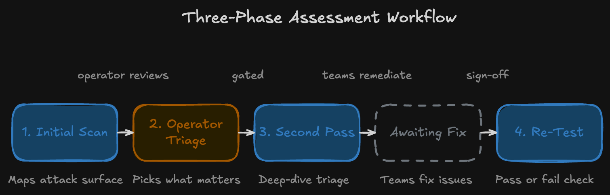
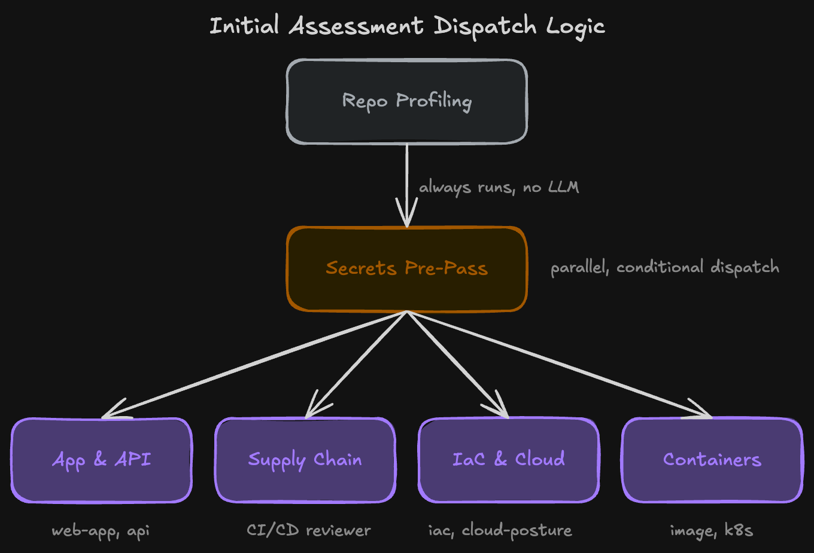

# R2: Repo Reaper


# System Design for Agentic Red Team Application Assessments

This is a system design document for Repo Reaper, a mostly agentic system for assessing codebases as a red teamer. The tool is a collection of Claude Agents, MCP Servers, custom scripts, and prompts for a human operator. This tool is designed to systematically deconstruct and analyze codebases from the perspective of a highly sophisticated, nation-state adversary.

## How to Use

1. Clone the repo
2. Run it with `python3 repo-reaper.py`
3. It will prompt you:
   
   ``` 
   1) Initial Repo Assessment # This will give the operator the attack surface with prompts to triage findings
   2) Second Pass # This will use the feedback from the initial repo assessment to inform the current test
   3) Re-test. # Run the exact same scenarios to validate fixes
   ```



## Design Validation

The tool runs in a three phase human operator-gated CLI. This works for a few reasons:

- **Human triage:** An LLM doesn't have enough context to know the criticality of one exposed API key vs another. The judgement call should remain with the operator

- **Defensible audit trail:** R2 will log and track "what was tested, when, and against what commit". This can be turned into a report and defended later.

- **Cost Control: **Deploying multiple parallel subagents across a large monorepo can get expensive. Gating behind an explicit operator kick off rather than auto-triggering on every push keeps spend predictable and intentional.

## How it Works



## Components

| Name         | Type        | Triggered By |
|--------------|-------------|--------------|
| Clone Repo    | Event       | User Action |
| Example B    | Automation  | Schedule     |
| Example C    | Alert       | System Rule  |

## Components

SAST


## How this can be improved

- Have an internal capabilities skill that can be referenced to know what offensive tooling we can use for certain or all parts of an attack chain. For instance, generate a C2 agent etc
- Read-only access to the entire github org as a reference point for all other company repos to use as context
-	I didn’t go to deep into frontend attacks (SQLi, XSS etc. because its pretty rare these days with the use of modern frameworks that sanitize input and output and parameterize queries properly etc.)
-	I also didn’t dive too deep into multi-tenancy, which is common for a SaaS
-	Would also leave out fuzzing, brute force type stuff, leave that to existing tools like Burp / Snyk. Its important to see how the app would handle that type of attack – resource exhaustion, fuzzing (does it lead to crash or memory leak) etc.
o	Even with unlimited time im not sure I would add this component. Tools do it well why change it.
-	I’ve left out the reporting – while that’s probably the most important part in a large boring org that non-technical management needs visibility, I don’t think that’s the case here. This might be quick turn around for assessments that we work with engineering teams etc. if we want to manage success of this program we can certainly find ways to do that but I think that’s out of the scope here.
-	Initial access methods - many cases of attacks have been from long running campaigns to phish users > get implants on dev workstations > beacon out to a c2 > possibly push malicious code to repos. That’s just a whole thing in itself that had to be scoped out.
-	Setting up the infra for this (MCP servers etc)
-	Security for this tool itself. How to ensure only intended operators access it. Maybe even a tls proxy inspection to monitor and validate the traffic is expected and prevent against prompt injection (maybe a repo has a malicious REDAMe, a planted prompt injection payload). How to ensure only an intended operator is running this.


